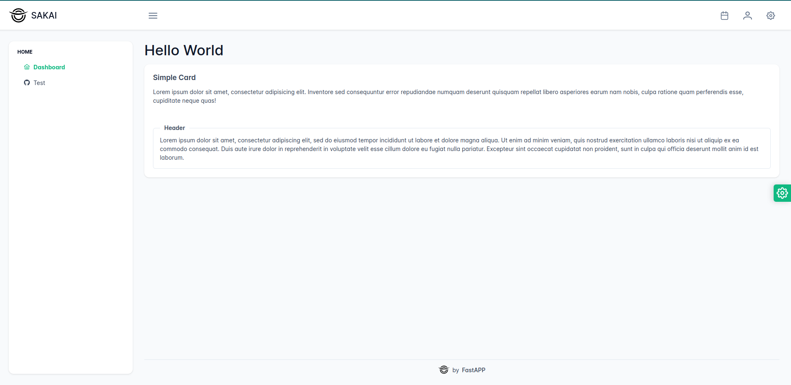

# 🌐 Nuxt 3 Starter Template with PrimeVue Sakai Theme

🚀 This is a base template for projects using **Nuxt 3** and **PrimeVue** with the modern and sleek [Sakai Theme](https://sakai.primevue.org/). Combine the power of Nuxt.js with the versatility of PrimeVue to build interactive and reactive web applications.



📚 **Relevant Documentation:**
- [Nuxt 3 Documentation](https://nuxt.com/docs/getting-started/introduction)
- [PrimeVue](https://primevue.org/)
- [Sakai Theme Preview](https://sakai.primevue.org/)

## ⚙️ Setup

Make sure to install the necessary dependencies:

```bash
# Using yarn
yarn install

# Using npm
npm install

# Using pnpm
pnpm install
```

## 🛠️ Development Server

Start the development server at `http://localhost:3000`:

```bash
npm run dev
```

## 🚢 Production

Build the application for production:

```bash
npm run build
```

Preview the production build locally:

```bash
npm run preview
```

📦 For more details on deployment, check out the [deployment documentation](https://nuxt.com/docs/getting-started/deployment).

---

🔍 **Explore the combination of Nuxt 3 and PrimeVue** to create stunning web applications with this minimal and easy-to-use template. Start now and build your next app with style and functionality! ✨